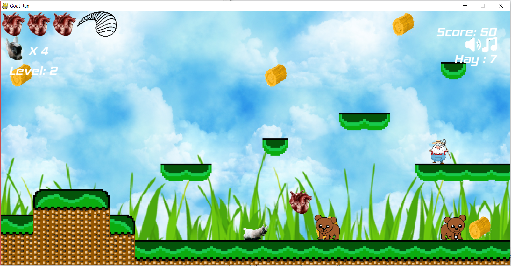

# GOAT RUN

## Characters
you get to play as a cute little baby goat :goat: named billy

## Enemies
### Bears are cute until they bite

### Farmers have pitch forks . . . Stabby Stabby

## How do I play this fantastic creation?
use the arrow keys to move side to side and use the space bar to jump 
to ~~kill~~ smother cute little bears and farmers with love
eat all the hay to fill Billy's tummy and get to the end of each level
collect hearts to stay alive and if you fill up the horn of life
you can gain an extra life by collecting med kits

## Look How cool it is!

## What do I need to play this amazing game?
a zip file to get you started
https://github.com/river-sneed/py.game_platformer.git
Goat run is made for python V 3.4 and py.game V 3.0

